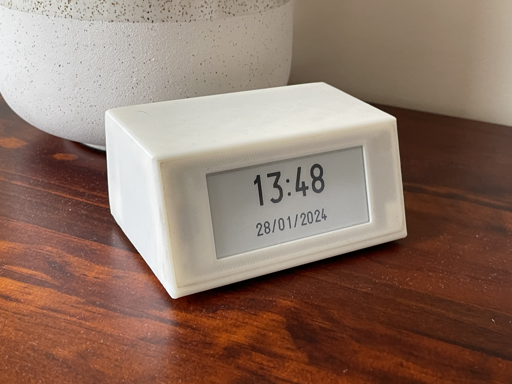
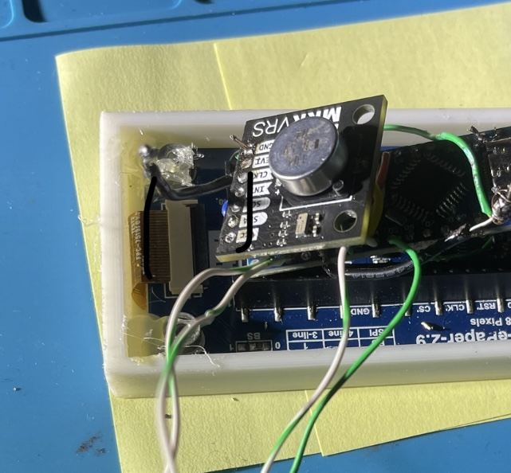
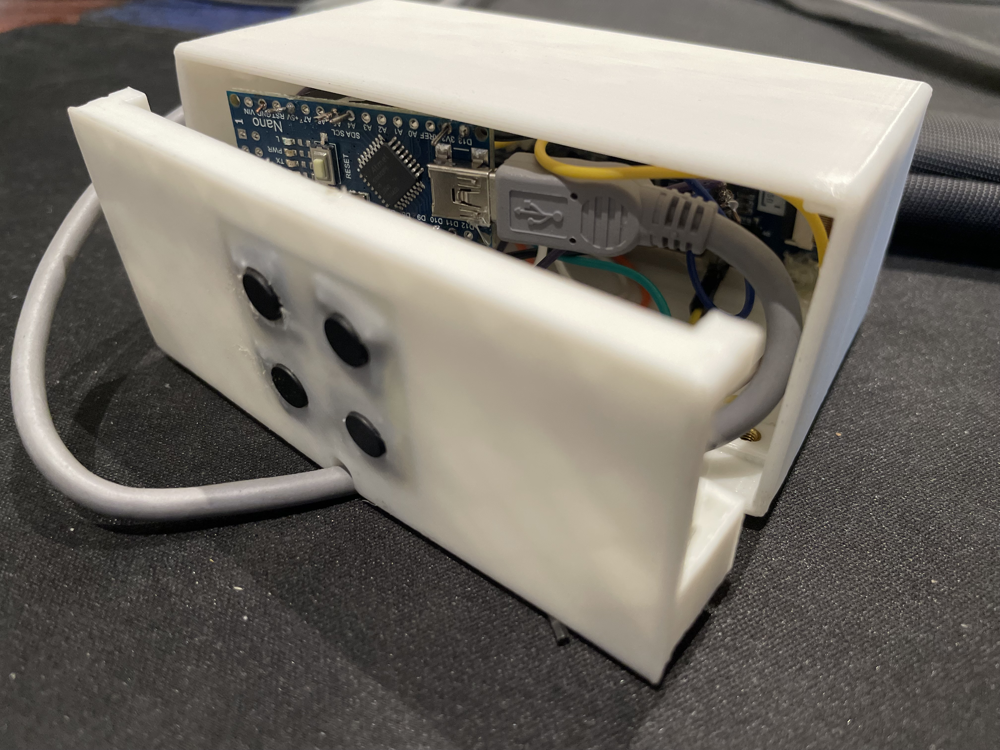

# Easy on the Eyes E-paper Clock

## Introduction
This project started as a desire to have a modern digital clock that would use the natural light of the room for illumination. This means that the screen is always at a natural brightness, with it looking like paper rather than a traditional screen. By using an E-paper display, blue light is not emitted meaning that the clock does not disrupt your circadian rhythm before bed. It seamlessly updates every minute, and on the hour the screen does a full refresh.

Another useful function of the clock is that it uses a supercapacitor to ensure the time is kept even when it is unplugged for extended periods of time. This means the time does not have to be set again after blackouts like most other clocks. 

## Build Guide
### **Assumed Knowledge**
- Soldering 
- Arduino IDE 
- 3D printing

### **Bill of Materials**
- 1x [Arduino Nano or compatible Nano board](https://core-electronics.com.au/nano-v3-0-board.html)
- 1x [Waveshare 2.9inch E-Paper Module for Raspberry Pi Pico](https://core-electronics.com.au/waveshare-2-9inch-e-paper-module-for-raspberry-pi-pico-296x128-black-white.html) 
- 1x [Makerverse Real Time Clock (RTC) with Supercapacitor Backup RV-3028](https://core-electronics.com.au/catalog/product/view/sku/CE07922)
- 4x [Push Button 12mm x 12mm](https://core-electronics.com.au/tactile-switch-buttons-12mm-square-6mm-tall-x-10-pack.html)
- 1x [Micro USB Cable](https://core-electronics.com.au/usb-cable-type-a-to-micro-b-1m.html)
- 6x M3 4mm length (OD 4.5mm) heated inserts
- 3x M3 16mm hex socket grubscrews
- Jumper wires
- Wires 
- Solder
- White PLA 3D printer filament\

### **Tools**
- 3D printer 
- Soldering Iron
- Hot glue gun

### **Wiring Table**

| Arduino | E-paper Display | RTC unit | Buttons                                                                                                       |
| ------- | --------------- | -------- | ------------------------------------------------------------------------------------------------------------- |
| 5V      | VSYS            |          |                                                                                                               |
| 3V3     |                 | Vcc      |                                                                                                               |
| GND     | GND             | GND      | All buttons bottom right pin                                                                                  |
| A4      |                 | SDA      |                                                                                                               |
| A5      |                 | SCL      |                                                                                                               |
| D2      |                 | INT      |                                                                                                               |
| D3      |                 |          | Button 1 bottom left pin (Down)                                                                               |
| D4      |                 |          | Button 2 bottom left pin (Change function from changing hours to changing minutes to exit changing time mode) |
| D5      |                 |          | Button 3 bottom left pin (Turn on changing time mode)                                                         |
| D6      | DC              |          |                                                                                                               |
| D7      | BUSY            |          |                                                                                                               |
| D8      |                 |          | Button 4 bottom right pin (Up)                                                                                |
| D9      | RST             |          |                                                                                                               |
| D10     | CS              |          |                                                                                                               |
| D11     | DIN             |          |                                                                                                               |
| D13     | CLK             | CLK      |                                                                                                               |

### **Schematic**

### **Assembly Instructions**
1. Connect the jumper wires from the Arduino’s male headers to the female headers on the E-paper module according to the schematic diagram or wiring table below. Some connections may need to be soldered, like the D13-CLK-CLK connection, since multiple devices are connecting to the same pin on the Arduino. The buttons all have to be soldered as well. Keep at least 8cm on each wire connected to the button so that there is enough slack for the buttons to be placed at the back of the case.
2. Optionally hot glue the jumper wire connections so that they cannot lose contact over time. For a more permanent setup, all the connections can be soldered.
3. Plug the Arduino Nano into your computer and adjust the Arduino sketch.
   	1. Ensure that the ZIP libraries are all installed. They are all on the Github repository below under the E-paper_Clock folder. Install them at Sketch → Include Library → Add .ZIP Library. The libraries are Low Power, GxEPD2 and U8g2 for Adafruit GFX.
	2. Ensure that the time and date variables (int year =, int month =, etc) are set to the current date and time.
	3. Uncomment line 59 by removing the ‘//’ from the start. Line 59:
```
//rtc.setTime(sec, minute, hour, day, date, month, year); //USE THIS TO INITALLY SET TIME. Once set it needs to be commented out so that it doesn't get set to this time every restart
```
3.
   	4. Upload the sketch. Set the board to Arduino AVR Boards → Arduino Nano. 
	5. Turn the line above back into a comment by adding the ‘//’ to the start so that it looks like:
```
//rtc.setTime(sec, minute, hour, day, date, month, year); //USE THIS TO INITALLY SET TIME. Once set it needs to be commented out so that it doesn't get set to this time every restart
```
3.
	6. Upload the sketch again. The clock is now programmed.
4. 3D print the 3 case parts. They can be printed individually or all together.
5. The main case might need a brim depending on your printer since the contact area is quite small.

#### Print settings:
- Filament type: PLA
- Nozzle Temperature: 210ºC
- Bed Temperature: 60ºC
- Infill: 15%
- Layer Height: 0.2mm
- Perimeters: 3
- Solid Layers:
- Top: 4
- Bottom: 4

6. Melt the heated inserts into the 6 holes in the 3d print using a soldering iron. [Video demonstration](https://youtu.be/i6GkWjcWj5w?t=235).
7. Remove the e-paper screen protector and position the screen in the 3d print with the screen opening. Hot glue the corners of the back of the screen to the 3d print.
  
8. Move all the electronics through the front of the main case and press the front closed. Its friction fit so it might take some force depending on your printer’s dimensional accuracy.
9. Hot glue each button to the back piece in the button holes. Order the buttons so that they make sense when using them to change the time, i.e. the down button is below the up button.
10. Plug the USB cable into the Arduino and guide the cable through the hole at the bottom of the back piece.
11. Push the back piece into the case of the clock. Once again it’s a friction fit.
12. Screw the 3 grubscrews through the heated inserts at the bottom of the case. This will hold all the pieces of the case together.
13. Plug the Arduino to a USB wall plug or computer port for power.

## How to Adjust the Time
1. Click the ‘Changing time mode button’
2. Use the up and down button to change the hour. There might be a little delay since e-paper screens have a low refresh rate.
3. Click the change function button so that the up and down buttons can be used to adjust the minutes.
4. Click the change function button again to exit change time mode. Once the screen does a full refresh, the new time is saved.
